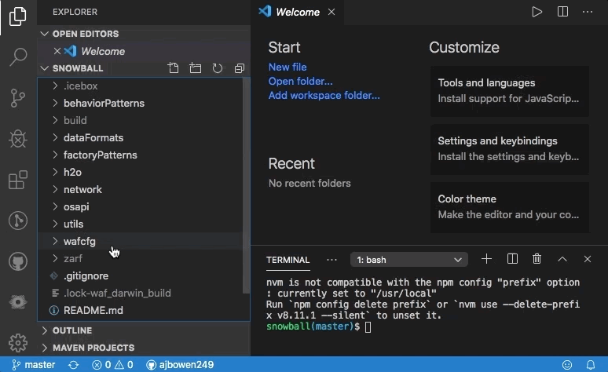
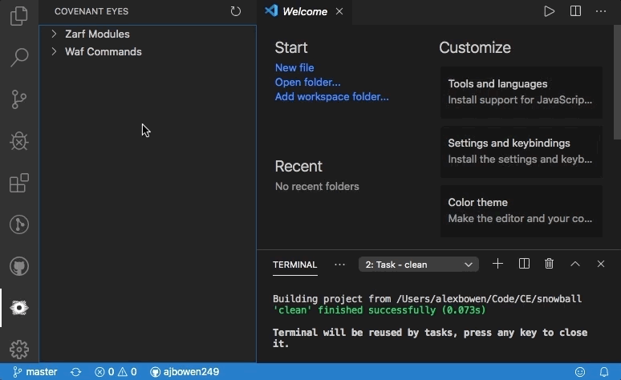
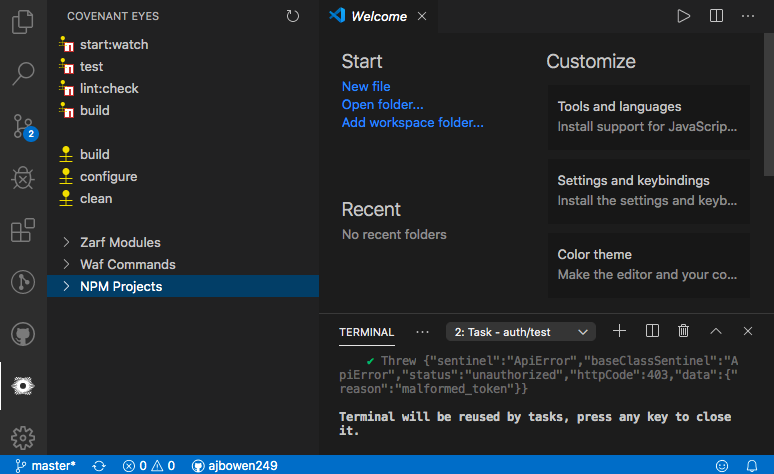
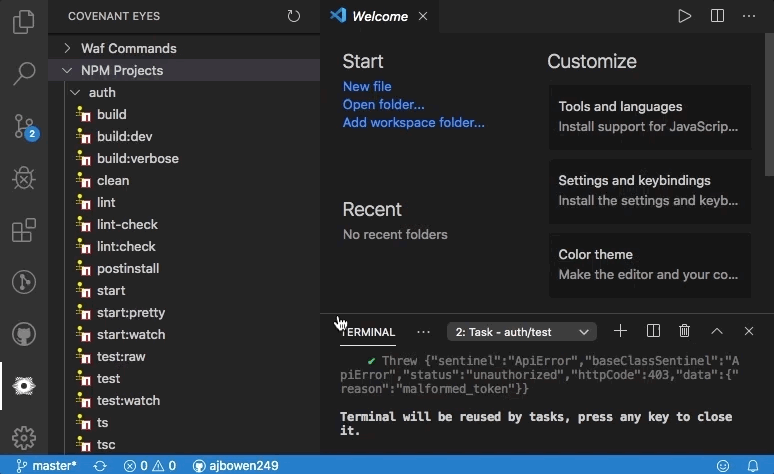
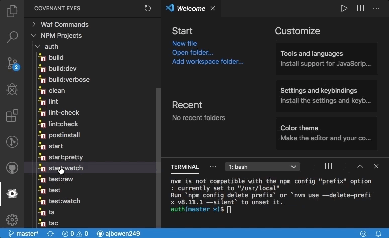
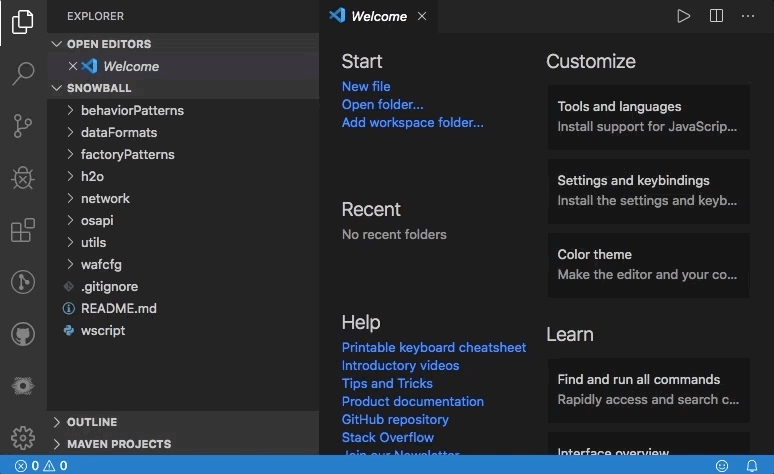

# ce-helper

This extension is specific to CovenantEyes Developers. Specifically, it helps to smooth over some operations with `zarf`, `waf`, and `wafexec`.

## Features

### Commands

The extension has a command tree view that allows clickable command execution for systems such as:

#### waf

#### Building Individual Zarf Modules

#### NPM Script Via wafexec

Scaffolder-based projects also have common commands "bubbled" up to the top of the list. Additional project types may be recognized in the future.

#### Command Management

Tasks started from the menu can be killed at any time.

Currently, only one task may be run at a time from the menu.

### Acquiring Zarf

When opening a freshly-cloned project that requires zarf, an option is presented to grab it automatically based on the `wscript`.

It also works if `zarf` is a submodule.

### Tasks

The three command types are implemented via VSCode Tasks, and each discovered operation is also registered as a task with a fixed name, so they can be used from non-gui VSCode settings.

- Waf tasks have the schema `waf: <command>`.
- Zarf submodules have the schema `zarf: build <relative/folder/path>`
- Wafexec-NPM scripts have the schema `wnpm: <project>/<script-name>`

For example, you can use a zarf build task in a debugger configuration:

## Known Issues

Task definitions are not particularly robust, as they lack properties. This means that tasks cannot be used via the `tasks.json` file, and everything is reliant on the fully-resolved tasks found automatically on extension startup.
